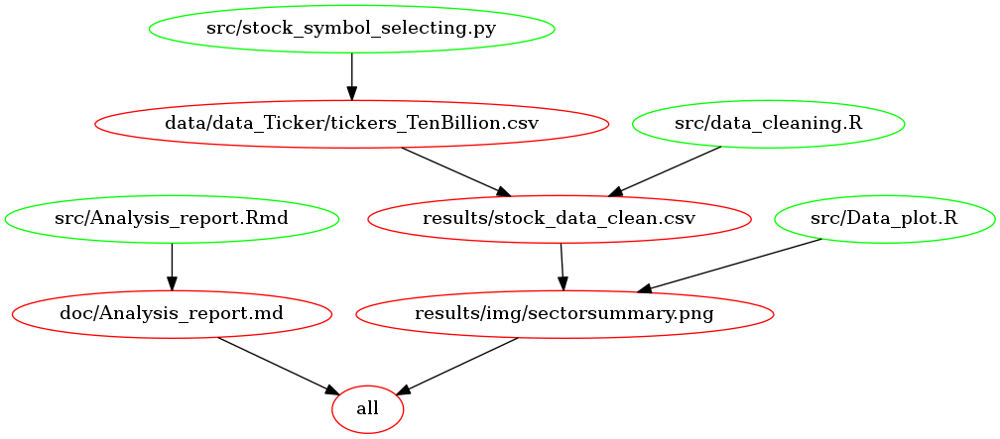

# Value Investment Analysis
Value investing has been a hot topic in the stock market. In particular, the success of Warren Buffett inspired many people to pursue the value investing approach. In this project, linear regression is used to test the value investing method.

Here, we follow the Buffett's approach. The six known Buffett's methodologies can be found [here](https://www.investopedia.com/articles/01/071801.asp):

1. Has the company consistently performed well?
2. Has the company avoided excess debt?
3. Are profit margins high? Are they increasing?
4. How long has the company been public?
5. Do the company's products rely on a commodity?
6. Is the stock selling at a 25% discount to its real value?

 The first four rules can be quantified using historical stock data. The other two require expertise in finance, so will not be considered here.

### Data Description
Stock data were downloaded from [stockrow.com](stockrow.com) and [Yahoo finance](https://ca.finance.yahoo.com). Thanks to them for making the data publicly available.

Data is cleaned using R language, including all financial data as well as median stock prices for each year. I will perform analysis of this cleaned dataset.


### Analysis
In this analysis, only stocks in US stock exchanges and have market capital larger than ten billion US dollars are considered. For small market cap stocks, parameters fluctuate a lot, and hence value investing may not apply well in general.  

The linear regression analysis is used to testing the dependence of stock price growth on the four parameters. Results is summarized in the final report in `./doc/Analysis_report.md`.

An interactive shiny app is built for visualzing the relationship between these parameters and annual stock price growth rates:
https://shunchi.shinyapps.io/stock_screening/ (source code repo is [here](https://github.com/ShunChi100/stock_screening))


### Scripts Executions
##### Dependency diagram of the Makefile


##### Option 1: run using the [Docker image](https://hub.docker.com/r/shunchi100/value_investing_analysis/)

Download the docker image by
```
docker pull shunchi100/value_investing_analysis
```
The image is about 2GB, so it takes sometime. (`sudo` may be needed if you are in Linux.)

Download the project from [github repo](https://github.com/ShunChi100/Value_investing_analysis)
```
git clone https://github.com/ShunChi100/Value_investing_analysis
```

Then with the docker image, run the following command:

1. Clean intermediate data files:
```
docker run --rm -v {your local project path}:/value_investing shunchi100/value_investing_analysis make -C '/value_investing' clean
```
Replace `{your local project path}` by the path to your downloaded repo root directory, for example, `/home/user/Value_investing_analysis`.

2. Run the scripts and generating reports:
```
docker run --rm -v {your local project path}:/value_investing shunchi100/value_investing_analysis make -C '/value_investing' all
```
The final report is generated and saved in `./doc/Analysis_report.md`

##### Option 2: use conda virtual environment and packrat
First clean the intermediate files. Go to the root directory and run the following code in terminal
```
# clean files
make clean
```

This project use both python3 and R. A python script is used to downloading online data. To run the script in a conda virtual environment, you need to install [anaconda](https://www.anaconda.com/download/#linux) first. Then go to the root directory of the project and run the following command in terminal
```
conda env create -f python3conda_env.yml
```
It will install necessary packages and create a virtual environment. In the virtual environment, run
```
make data/data_Ticker/tickers_TenBillion.csv
```
It will download all required data from Yahoo.com and Stockrow.com.

Now you can exit the Python virtual environment.

Then we need to run rscripts inside a `packrat` local environment. To activate the `packrat` local environment, you need _Rstudio_  to open the `value_investing.Rproj` in the project root directory. `packrat` should automatically install all required libraries. (If not automatically installing, run `packrat::restore()` in the R console inside _Rstudio_.)

Now the local R environment is established. Then in the terminal, simply run
```
# reading data
make results/stock_data_clean.csv

# generate graphs
make results/img/sectorsummary.png

# generate final report
make doc/Analysis_report.md
```


##### Option 3: run using your local computer R and Python
please run in bash terminal in the __project root directory__ (it works well on my Ubuntu and Mac systems)
```
# clean files
make clean

# downloading, reading, and writing data
make all
```

`make all` takes about five minutes to run. (There are some package dependency, please see __Required Packages__ below.)


### Required packages
#####python
```
import requests
import pandas as pd
import numpy as np
import argparse
import time
import datetime
import re
```
#####R
```
library(tidyverse)
library(XLConnect)
library(stringr)
library(lubridate)
```

__Note:__

If the Makefile doesn't work on your computer, it is probably because of missing packages. In particular, there are data in the `.xlsx` format, an R package "XLConnect" is used. "XLConnect" requires "rJava" package which may not be on your computer.

For Ubuntu: run the following command in your terminal to install rJava
```
sudo apt-get install r-cran-rjava
```
For MaxOS: it is a little bit complicated. I followed the steps in this [url](https://github.com/snowflakedb/dplyr-snowflakedb/wiki/Configuring-R-rJava-RJDBC-on-Mac-OS-X) and it works fine on my Macbook.
