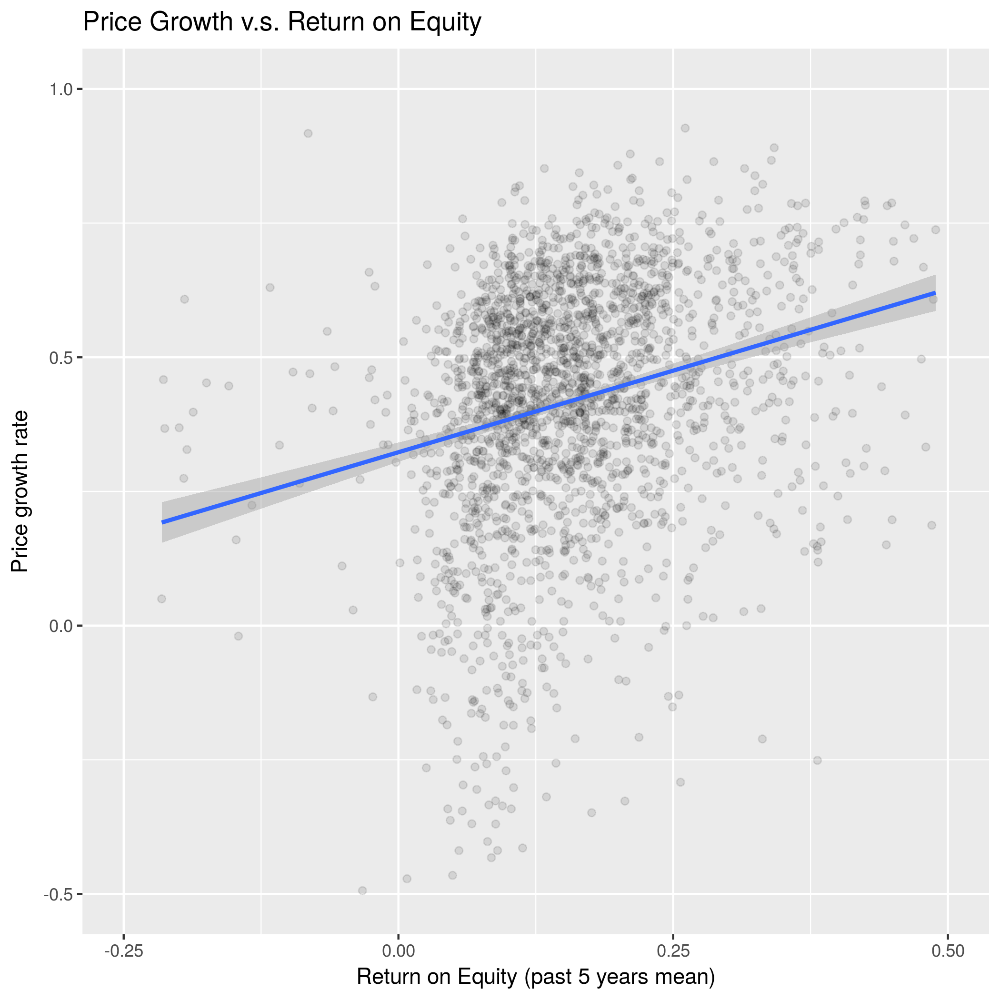
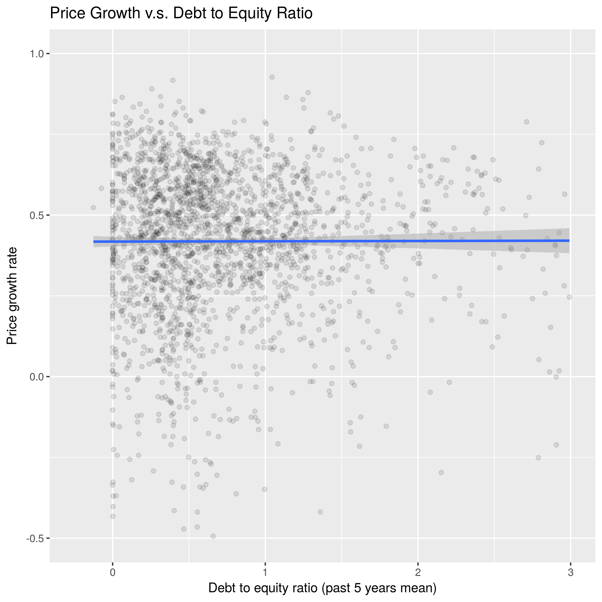

# Value investing analysis

Investing is an important part of one's life. With a proper investing, one would have a retired life free of worrying money. Nowadays, most investing is done by financial institutes. However, many financial institutes charge a good amount of managing fee but have under average performance. Can we invest stocks by ourselves? Yes, we can but it can be very risky. One relatively less risky investing method is called value investing. It has been a hot topic in the stock market for decades. In particular, the success of Warren Buffett inspired many people to pursue this approach.

In this report, I did a quantitative analysis on the historical stock data to test the value investing method. Stock data were downloaded from [stockrow.com](stockrow.com) and [Yahoo finance](https://ca.finance.yahoo.com).

The six fundamental Buffett's methodologies can be found [here](https://www.investopedia.com/articles/01/071801.asp):

1. Has the company consistently performed well? (Return on Equity)
2. Has the company avoided excess debt? (Debt to Equity Ratio (DEratio))
3. Are profit margins high? Are they increasing? (Profit Margin)
4. Is the stock selling at a 25% discount to its real value? (Price to Earning ratio (PE))
5. How long has the company been public? (At least have previous five years data)
6. Do the company's products rely on a commodity? 

The first four rules can be quantified using historical data: Return on Equity (ROE), Debt to Equity Ratio (DEratio), Profit Margin (Profit_Margin), and Price to Earning ratio (PEratio). The fifth row is guaranteed by calculating the means of the first three quantities of previous five years, defined as `ROE_5Y`, `DEratio_5Y`, `Profit_Margin_5Y`. That means the companies are at least five years in public stock exchanges. The sixth rule requires expertise in finance, so will not be considered here. In this analysis, only stocks with market capital larger than ten billion US dollars are considered. For small market cap stocks, parameters fluctuate a lot, and hence value investing may not apply well in general.  

#### Analysis results

The data has 17 variables. In this study, we focus on the four quantities as discussed above.

```r
# Read cleaned data
library(tidyverse)
stock <- read_csv("./results/stock_data_clean.csv")
glimpse(stock)
```

```
## Observations: 3,139
## Variables: 17
## $ Symbol           <chr> "ALXN", "ALXN", "ALXN", "ALXN", "ALXN", "ALXN...
## $ Name             <chr> "Alexion Pharmaceuticals, Inc.", "Alexion Pha...
## $ MarketCap        <dbl> 25861900389, 25861900389, 25861900389, 258619...
## $ Sector           <chr> "Health Care", "Health Care", "Health Care", ...
## $ Industry         <chr> "Major Pharmaceuticals", "Major Pharmaceutica...
## $ Year             <int> 2016, 2015, 2014, 2013, 2012, 2011, 2016, 201...
## $ Date             <date> 2016-12-31, 2015-12-31, 2014-12-31, 2013-12-...
## $ Median_Quote     <dbl> 127.810, 132.430, 178.205, 165.380, 102.195, ...
## $ Median_Q_Growth  <dbl> 0.6808153, 0.7939666, 0.8676103, 0.8687039, 0...
## $ ROE              <dbl> 0.045893720, 0.017435525, 0.198969236, 0.1061...
## $ ROE_5Y           <dbl> 0.09955193, 0.12127953, 0.14036447, 0.1863303...
## $ DEratio          <dbl> 0.3782, 0.4324, 0.0498, 0.0610, 0.0756, 0.000...
## $ DEratio_5Y       <dbl> 0.19940, 0.12376, 0.03848, 0.03168, 0.13626, ...
## $ Profit_Margin    <dbl> 0.129, 0.055, 0.294, 0.163, 0.225, 0.224, 0.1...
## $ Profit_Margin_5Y <dbl> 0.1732, 0.1922, 0.2170, 0.3108, 0.3038, 0.002...
## $ PEratio          <dbl> 71.803370, 194.749990, 53.676205, 128.201554,...
## $ Revenue_Growth   <dbl> 0.1843, 0.1656, 0.4400, 0.3679, 0.4476, 0.448...
```

Here, we also filter out "outliers" that give abnormal values. These "outliers" don't help for analyzing the average case. Non-interactive linear regression result is shown below.


```r
stock <- filter(stock, stock$ROE_5Y<0.5, stock$ROE_5Y> -0.25, stock$DEratio_5Y>-0.5, stock$DEratio_5Y<3, stock$PEratio > 0, stock$PEratio < 40, stock$Profit_Margin_5Y >-0.2, stock$Profit_Margin_5Y < 0.4)

lm <- summary(lm(Median_Q_Growth~ROE_5Y + DEratio_5Y + Profit_Margin_5Y + PEratio, data = stock))
broom::tidy(lm)
```

```
##               term    estimate    std.error  statistic      p.value
## 1      (Intercept) 0.078111601 0.0198727150  3.9305954 8.733536e-05
## 2           ROE_5Y 0.702253770 0.0616705931 11.3871739 3.096739e-29
## 3       DEratio_5Y 0.007823423 0.0096253862  0.8127905 4.164255e-01
## 4 Profit_Margin_5Y 0.036117832 0.0725162074  0.4980656 6.184872e-01
## 5          PEratio 0.010710324 0.0007493555 14.2927137 2.150379e-44
```

Here we set the allowed type I error is $\alpha = 0.05$. We can see that `ROE_5Y`, and `PEratio` probably have effects on the price growth of the stocks since their P-values are very small. `DEratio_5Y` and `Profit_Margin_5Y` have relative large P-values, so we cannot safely reject the null hypothesis that they don't affect the growth of stock prices. To have a better feeling of the relationships. the linear fits between the growth of stock price and the four quantities are shown below. 

In summary, according to this analysis, at least two parameters can be used as indicators for value investing. Next, we can apply supervised learning algorithms by using these quantities (features) and find a model to predict stocks that have good pentetial to grow.






