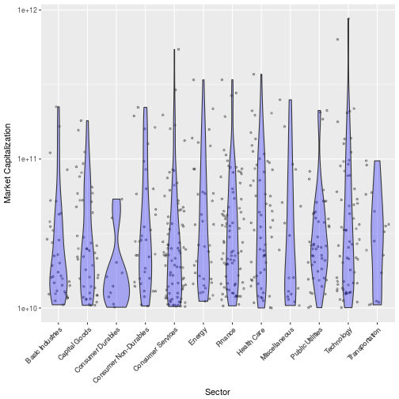
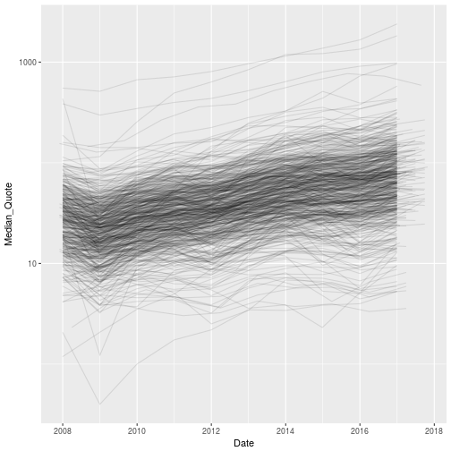
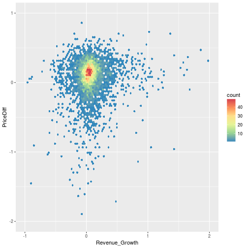
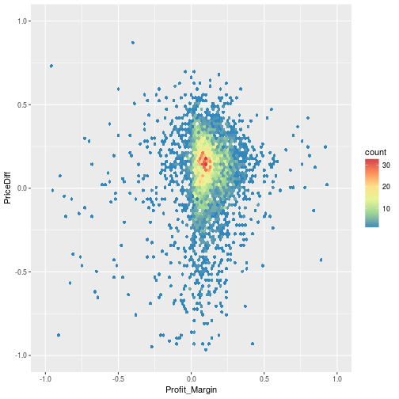
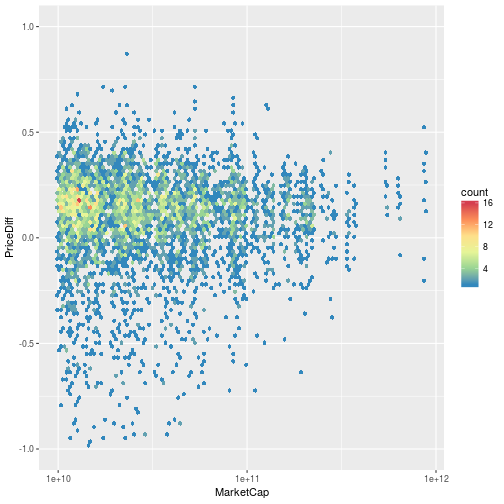
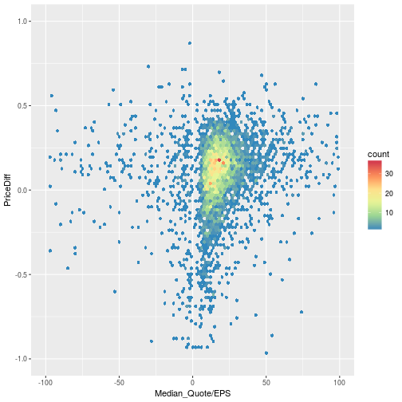

```r
library(tidyverse)
```

```
## Loading tidyverse: ggplot2
## Loading tidyverse: tibble
## Loading tidyverse: tidyr
## Loading tidyverse: readr
## Loading tidyverse: purrr
## Loading tidyverse: dplyr
```

```
## Conflicts with tidy packages ----------------------------------------------
```

```
## filter(): dplyr, stats
## lag():    dplyr, stats
```

```r
library(feather)
library(lubridate)
```

```
## Loading required package: methods
```

```
## 
## Attaching package: 'lubridate'
```

```
## The following object is masked from 'package:base':
## 
##     date
```

## Data wrangling

Select financial indicators for analysis.


```r
stock_all <- read_feather("../data/stock_data_clean.feather")
glimpse(stock_all)
```

```
## Observations: 5,369
## Variables: 124
## $ Symbol                                                <chr> "ATVI", ...
## $ Name                                                  <chr> "Activis...
## $ LastSale                                              <dbl> 64.10, 6...
## $ MarketCap                                             <dbl> 4.847e+1...
## $ IPOyear                                               <chr> "n/a", "...
## $ Sector                                                <chr> "Technol...
## $ industry                                              <chr> "Compute...
## $ `Summary Quote`                                       <chr> "http://...
## $ Exchange                                              <chr> "NASDAQ"...
## $ Symbolb                                               <chr> NA, NA, ...
## $ Date                                                  <date> 2016-12...
## $ Median_Quote                                          <dbl> 58.51000...
## $ Lower_Quote                                           <dbl> 38.84417...
## $ Upper_Quote                                           <dbl> 65.11300...
## $ Revenues                                              <dbl> 66080000...
## $ Revenue_Growth                                        <dbl> 0.4168, ...
## $ Cost_of_Revenue                                       <dbl> 23940000...
## $ Gross_Profit                                          <dbl> 42140000...
## $ Research_and_Development_Expense                      <dbl> 95800000...
## $ Selling_General_and_Administrative_Expense            <dbl> 18440000...
## $ Operating_Expenses                                    <dbl> 28020000...
## $ Operating_Income                                      <dbl> 14120000...
## $ Interest_Expense                                      <dbl> 21400000...
## $ Earnings_before_Tax                                   <dbl> 11060000...
## $ Income_Tax_Expense                                    <dbl> 14000000...
## $ Net_Income_to_Non_Controlling_Interests               <dbl> 0, 0, 0,...
## $ Net_Income_from_Discontinued_Operations               <dbl> 0e+00, 0...
## $ Net_Income                                            <dbl> 96600000...
## $ Preferred_Dividends_Income_Statement_Impact           <dbl> 0, 0, 0,...
## $ Net_Income_Common_Stock                               <dbl> 96600000...
## $ EPS                                                   <dbl> 1.30, 1....
## $ EPS_Diluted                                           <dbl> 1.28, 1....
## $ Weighted_Average_Shares                               <dbl> 74000000...
## $ Weighted_Average_Shares_Diluted                       <dbl> 75400000...
## $ Dividends_per_Basic_Common_Share                      <dbl> 0.26, 0....
## $ Gross_Margin                                          <dbl> 0.6377, ...
## $ EBITDA_Margin                                         <dbl> 0.325, 0...
## $ EBIT_Margin                                           <dbl> 0.1998, ...
## $ Profit_Margin                                         <dbl> 0.146, 0...
## $ Free_Cash_Flow_Margin                                 <dbl> 0.3055, ...
## $ EBITDA                                                <dbl> 21490000...
## $ EBIT                                                  <dbl> 13200000...
## $ Consolidated_Income                                   <dbl> 96600000...
## $ Book_Value_per_Share                                  <dbl> 12.273, ...
## $ Tangible_Book_Value_per_Share                         <dbl> 7.214, 9...
## $ FCF_per_Share                                         <dbl> 2.728, 1...
## $ Interest_Debt_per_Share                               <dbl> 6.6041, ...
## $ Cash_per_Share                                        <dbl> 4.3851, ...
## $ Debt_to_Equity_Ratio                                  <dbl> 0.5359, ...
## $ Total_Debt_To_Total_Assets                            <dbl> 0.2800, ...
## $ Interest_Coverage                                     <dbl> 6.1682, ...
## $ Current_Ratio                                         <dbl> 1.819, 1...
## $ Income_Quality                                        <dbl> 2.2308, ...
## $ Payout_Ratio                                          <dbl> 0.200, 0...
## $ Intangible_Assets_out_of_Total_Assets                 <dbl> 0.6929, ...
## $ Selling_General_and_Administrative_Expense_of_Revenue <dbl> 0.2791, ...
## $ Research_and_Development_Expense_of_Revenue           <dbl> 0.1450, ...
## $ Working_Capital                                       <dbl> 21740000...
## $ Tangible_Asset_Value                                  <dbl> 53600000...
## $ Net_Current_Asset_Value                               <dbl> -3503000...
## $ Invested_Capital                                      <dbl> 43460000...
## $ Average_Receivables                                   <dbl> 70550000...
## $ Average_Payables                                      <dbl> 25300000...
## $ Average_Inventory                                     <dbl> 88500000...
## $ Average_Days_of_Receivables                           <dbl> 40.4328,...
## $ Average_Days_of_Payables                              <dbl> 12.2624,...
## $ Days_of_Inventory_on_Hand                             <dbl> 2.7066, ...
## $ Account_Receivables_Turnover                          <dbl> 9.3664, ...
## $ Account_Payables_Turnover                             <dbl> 7.9605, ...
## $ Inventory_Turnover                                    <dbl> 74.6667,...
## $ ROIC                                                  <dbl> 0.0764, ...
## $ Cash_and_Equivalents                                  <dbl> 32450000...
## $ Investments_Current                                   <dbl> 0, 0, 10...
## $ Trade_and_Non_Trade_Receivables                       <dbl> 73200000...
## $ Inventory                                             <dbl> 49000000...
## $ Current_Assets                                        <dbl> 48300000...
## $ Property_Plant_and_Equipment_Net                      <dbl> 25800000...
## $ Goodwill_and_Intangible_Assets                        <dbl> 12092000...
## $ Investments_Non_Current                               <dbl> 0, 35610...
## $ Tax_Assets                                            <dbl> 28300000...
## $ Assets_Non_Current                                    <dbl> 12622000...
## $ Total_Assets                                          <dbl> 17452000...
## $ Trade_and_Non_Trade_Payables                          <dbl> 22200000...
## $ Debt_Current                                          <dbl> 0, 0, 0,...
## $ Current_Liabilities                                   <dbl> 26560000...
## $ Debt_Non_Current                                      <dbl> 48870000...
## $ Deferred_Revenue                                      <dbl> 16280000...
## $ Tax_Liabilities                                       <dbl> 44000000...
## $ Deposit_Liabilities                                   <dbl> 0, 0, 0,...
## $ Liabilities_Non_Current                               <dbl> 56770000...
## $ Total_Liabilities                                     <dbl> 83330000...
## $ Accumulated_Other_Comprehensive_Income                <dbl> -6290000...
## $ Accumulated_Retained_Earnings_Deficit                 <dbl> 48690000...
## $ Shareholders_Equity                                   <dbl> 91190000...
## $ Investments                                           <dbl> 0, 35610...
## $ Total_Debt                                            <dbl> 48870000...
## $ Cash_and_Short_Term_Investments                       <dbl> 32450000...
## $ Gross_Profit_Growth                                   <dbl> 0.3686, ...
## $ EBIT_Growth                                           <dbl> 0.0008, ...
## $ Net_Income_Growth                                     <dbl> 0.0830, ...
## $ EPS_Growth                                            <dbl> 0.0744, ...
## $ EPS_Diluted_Growth                                    <dbl> 0.0756, ...
## $ Weighted_Average_Shares_Diluted_Growth                <dbl> 0.0203, ...
## $ Operating_Cash_Flow_Growth                            <dbl> 0.7117, ...
## $ Assets_Growth                                         <dbl> 0.1447, ...
## $ Debt_Growth                                           <dbl> 0.1996, ...
## $ Trade_and_Non_Trade_Receivables_Growth                <dbl> 0.0781, ...
## $ Inventory_Growth                                      <dbl> -0.6172,...
## $ Dividends_per_Basic_Common_Share_Growth               <dbl> 0.1304, ...
## $ Book_Value_per_Share_Growth                           <dbl> 0.1120, ...
## $ Depreciation_and_Amortization                         <dbl> 82900000...
## $ Share_Based_Compensation                              <dbl> 14700000...
## $ Operating_Cash_Flow                                   <dbl> 21550000...
## $ Capital_Expenditure                                   <dbl> -1360000...
## $ Net_Cash_Flow___Business_Acquisitions_and_Disposals   <dbl> -4588000...
## $ Net_Cash_Flow___Investment_Acquisitions_and_Disposals <dbl> 0, 0, 21...
## $ Investing_Cash_Flow                                   <dbl> -1177000...
## $ Issuance_Repayment_of_Debt_Securities                 <dbl> 77400000...
## $ Issuance_Purchase_of_Equity_Shares                    <dbl> 10600000...
## $ Payment_of_Dividends_and_Other_Cash_Distributions     <dbl> -1.95e+0...
## $ Financing_Cash_Flow                                   <dbl> 50000000...
## $ Effect_of_Exchange_Rate_Changes_on_Cash               <dbl> -5600000...
## $ Net_Cash_Flow___Change_in_Cash_and_Cash_Equivalents   <dbl> 14220000...
## $ Free_Cash_Flow                                        <dbl> 20190000...
```


```r
colum_list_to_keep <- c("Symbol", "Name", "MarketCap", "Sector", "industry", "Date", "Median_Quote", "Lower_Quote", "Upper_Quote", "Revenues", "Revenue_Growth", "Profit_Margin", "EPS", "Debt_to_Equity_Ratio","Net_Income", "Shareholders_Equity", "Cash_per_Share", "Book_Value_per_Share")

stock <- stock_all %>% 
        select(colum_list_to_keep)

stock$Sector <- factor(stock$Sector)
stock$industry <- factor(stock$industry)
stock$Symbol <- factor(stock$Symbol)

stock <- mutate(stock, Year = year(Date))


glimpse(stock)
```

```
## Observations: 5,369
## Variables: 19
## $ Symbol               <fctr> ATVI, ATVI, ATVI, ATVI, ATVI, ATVI, ATVI...
## $ Name                 <chr> "Activision Blizzard, Inc", "Activision B...
## $ MarketCap            <dbl> 4.847e+10, 4.847e+10, 4.847e+10, 4.847e+1...
## $ Sector               <fctr> Technology, Technology, Technology, Tech...
## $ industry             <fctr> Computer Software: Prepackaged Software,...
## $ Date                 <date> 2016-12-31, 2015-12-31, 2014-12-31, 2013...
## $ Median_Quote         <dbl> 58.51000, 37.63955, 25.20926, 20.09384, 1...
## $ Lower_Quote          <dbl> 38.844178, 30.495609, 19.748855, 16.64451...
## $ Upper_Quote          <dbl> 65.11300, 43.94097, 38.08993, 22.76586, 1...
## $ Revenues             <dbl> 6608000000, 4664000000, 4408000000, 45830...
## $ Revenue_Growth       <dbl> 0.4168, 0.0581, -0.0382, -0.0562, 0.0212,...
## $ Profit_Margin        <dbl> 0.146, 0.191, 0.189, 0.220, 0.237, 0.228,...
## $ EPS                  <dbl> 1.30, 1.21, 1.14, 0.96, 1.01, 0.93, 0.34,...
## $ Debt_to_Equity_Ratio <dbl> 0.5359, 0.5050, 0.5978, 0.7087, 0.0000, 0...
## $ Net_Income           <dbl> 966000000, 892000000, 835000000, 10100000...
## $ Shareholders_Equity  <dbl> 9119000000, 8068000000, 7233000000, 66220...
## $ Cash_per_Share       <dbl> 4.3851, 2.5041, 6.7709, 4.3066, 3.5603, 2...
## $ Book_Value_per_Share <dbl> 12.273, 11.037, 10.018, 6.467, 10.205, 9....
## $ Year                 <dbl> 2016, 2015, 2014, 2013, 2012, 2011, 2010,...
```

## Visulization

First exploration of the dataset


```r
stock %>% filter( Year == 2016 ) %>% 
        ggplot(aes(y = MarketCap, x = Sector))+
        geom_jitter(size = 1, alpha = 0.3)+
        geom_violin(fill = "blue", alpha = 0.3)+
        theme(axis.text.x = element_text(angle = 45, hjust = 1))+
        scale_y_log10("Market Capitalization", breaks = c(1,10,100)*10000000000)
```




Visualized stock growth (percentage to last year) vs time. Overall, the prices grow in the last 9 year.


```r
stock %>% ggplot(aes(y = Median_Quote, x = Date, group = Symbol))+
        geom_line(alpha = 0.1)+
        scale_y_log10()
```

```
## Warning: Removed 18 rows containing missing values (geom_path).
```




Visualized stock growth (percentage to last year) vs revenue growth rate


```r
 stock_new <- stock %>% group_by(Symbol) %>% mutate(PriceDiff = c(-diff(Median_Quote), NA_real_)/Median_Quote)
 stock_new %>%
        ggplot(aes(y = PriceDiff, x = Revenue_Growth ))+
        geom_hex(bins = 100)+
        scale_x_continuous(limits = c(-1 , 2))+
        scale_y_continuous(limits = c(-2, 1))+
        scale_fill_distiller(palette = "Spectral")
```

```
## Warning: Removed 589 rows containing non-finite values (stat_binhex).
```




Visualized stock growth (percentage to last year) vs profit margin


```r
# stock_new <- stock %>% group_by(Symbol) %>% mutate(PriceDiff = c(-diff(Median_Quote), NA_real_)/Median_Quote)
 stock_new %>%
        ggplot(aes(y = PriceDiff, x = Profit_Margin ))+
        geom_hex(bins = 100)+
        scale_x_continuous(limits = c(-1 , 1))+
        scale_y_continuous(limits = c(-1, 1))+
        scale_fill_distiller(palette = "Spectral")
```

```
## Warning: Removed 641 rows containing non-finite values (stat_binhex).
```

```
## Warning: Removed 1 rows containing missing values (geom_hex).
```




Visualized stock growth (percentage to last year) vs different market cap size.


```r
# stock_new <- stock %>% group_by(Symbol) %>% mutate(PriceDiff = c(-diff(Median_Quote), NA_real_)/Median_Quote)
 stock_new %>%
        ggplot(aes(y = PriceDiff, x = MarketCap ))+
        geom_hex(bins = 100)+
        scale_x_log10(breaks = c(1,10 , 100)*10000000000)+
        scale_y_continuous(limits = c(-1, 1))+
        scale_fill_distiller(palette = "Spectral")
```

```
## Warning: Removed 601 rows containing non-finite values (stat_binhex).
```




Visualized stock growth (percentage to last year) vs PE ratio


```r
# stock_new <- stock %>% group_by(Symbol) %>% mutate(PriceDiff = c(-diff(Median_Quote), NA_real_)/Median_Quote)
 stock_new %>%
        ggplot(aes(y = PriceDiff, x = Median_Quote/EPS ))+
        geom_hex(bins = 100)+
        scale_x_continuous(limits = c(-100 , 100))+
        scale_y_continuous(limits = c(-1, 1))+
        scale_fill_distiller(palette = "Spectral")
```

```
## Warning: Removed 795 rows containing non-finite values (stat_binhex).
```

```
## Warning: Removed 1 rows containing missing values (geom_hex).
```




Things to check

> For instance, an investor who is looking to buy undervalued stocks might select one with a low price-to-earnings ratio. The implicit hope is that the price would rise such that its price-to-earnings ratio will rebound to a level more in line with its peers. But what Kok et al. found is that the opposite is more likely to happen — the price-to-earnings ratio will return to normal levels, but only because the earnings in the denominator fell.
